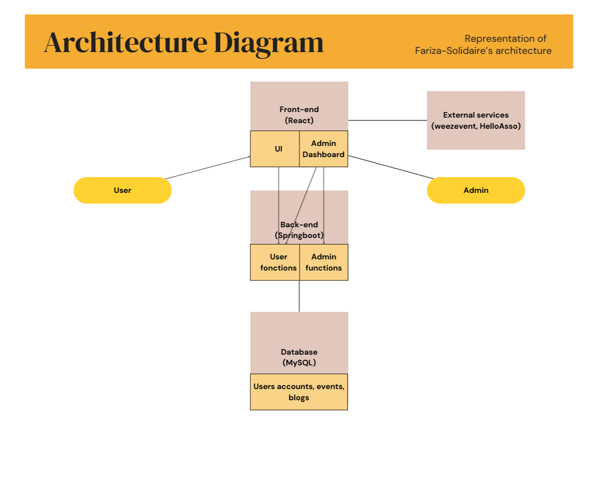

## 2. System Architecture

    * Style: 
        Client–Server, REST API backend, web frontend.
    
    * Components:
        - Frontend: Web app for job seekers, donators, partners, admins.
        - Backend: REST API handling authentication.
        - Database: Stores users, events, blogs.
    
    * External Services: Email/SMS notification service (weezevent).

 📊 Deliverable: High-level diagram showing:

