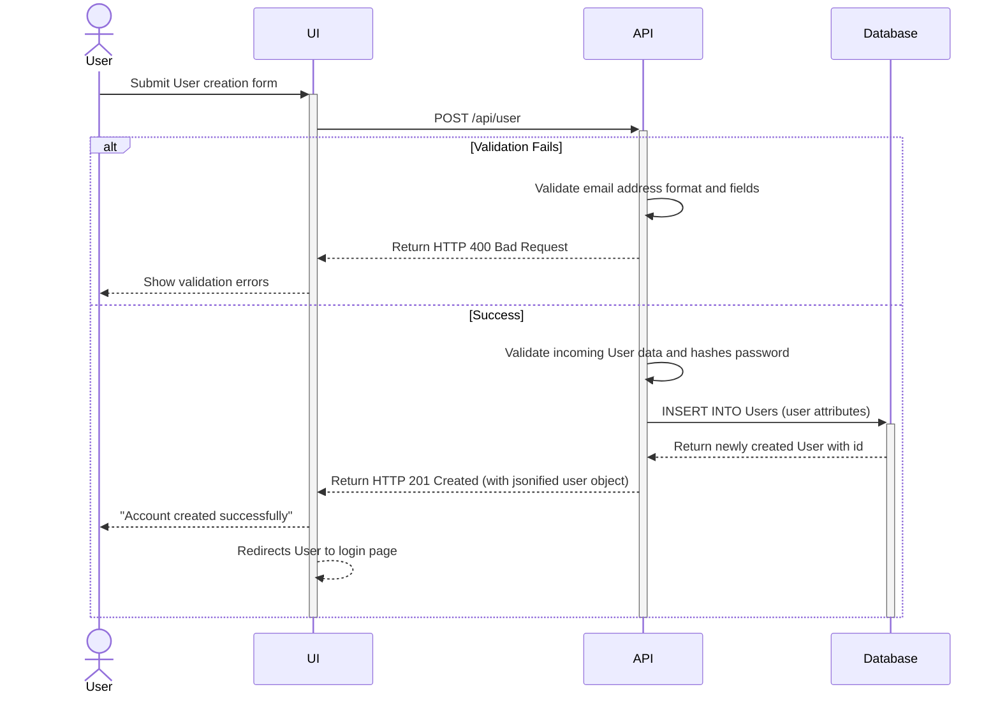
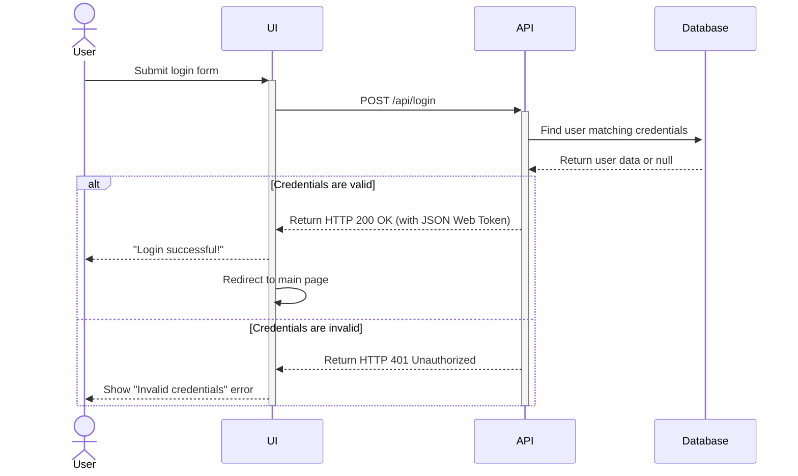
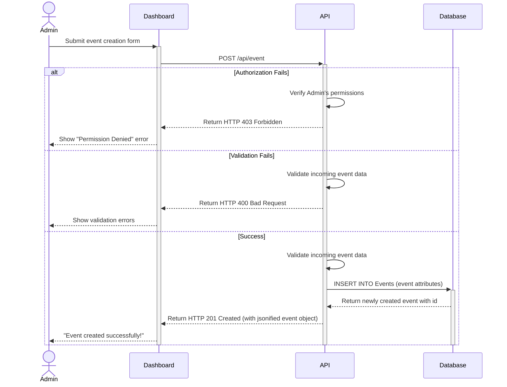

## 3 - Creating High-Level Sequence Diagrams

### User Account Creation Sequence Diagram

```mermaid

sequenceDiagram
    actor User
    participant UI
    participant API
    participant Database

    User->>+UI: Submit User creation form
    UI->>+API: POST /api/user

    alt Validation Fails
        API->>API: Validate email address format and fields
        API-->>UI: Return HTTP 400 Bad Request
        UI-->>User: Show validation errors

    else Success
        API->>API: Validate incoming User data and hashes password
        API->>+Database: INSERT INTO Users (user attributes)
        Database-->>API: Return newly created User with id
        API-->>UI: Return HTTP 201 Created (with jsonified user object)
        UI-->>User: "Account created successfully"
        UI-->>UI: Redirects User to login page
    end

    deactivate UI
    deactivate Database
    deactivate API

```

### User Login Sequence Diagram

```mermaid

sequenceDiagram
    actor User
    participant UI
    participant API
    participant Database

    User->>+UI: Submit login form
    UI->>+API: POST /api/login

    API->>+Database: Find user matching credentials
    Database-->>API: Return user data or null

    alt Credentials are valid
        API-->>UI: Return HTTP 200 OK (with JSON Web Token)
        UI-->>User: "Login successful!"
        UI->>UI: Redirect to main page

    else Credentials are invalid
        API-->>UI: Return HTTP 401 Unauthorized
        UI-->>User: Show "Invalid credentials" error
    end

    deactivate API
    deactivate UI

```

### Admin Event Creation Sequence Diagram

```mermaid

sequenceDiagram
    actor Admin
    participant Dashboard
    participant API
    participant Database

    Admin->>+Dashboard: Submit event creation form
    Dashboard->>+API: POST /api/event

    alt Authorization Fails
        API->>API: Verify Admin's permissions
        API-->>Dashboard: Return HTTP 403 Forbidden
        Dashboard-->>Admin: Show "Permission Denied" error

    else Validation Fails
        API->>API: Validate incoming event data
        API-->>Dashboard: Return HTTP 400 Bad Request
        Dashboard-->>Admin: Show validation errors

    else Success
        API->>API: Validate incoming event data
        API->>+Database: INSERT INTO Events (event attributes)
        Database-->>API: Return newly created event with id
        API-->>Dashboard: Return HTTP 201 Created (with jsonified event object)
        Dashboard-->>Admin: "Event created successfully!"
    end

    deactivate Dashboard
    deactivate Database
    deactivate API

```
