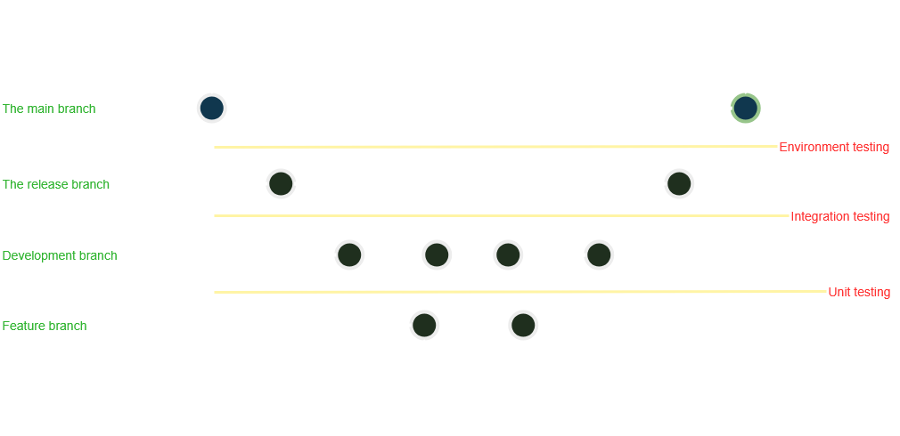

# Source Control Management and Quality Assurance Strategy

## Source Control Management Tools and Strategy

Our team will use **Git** as the version control system, with a **feature-based branching strategy**. This approach helps isolate development tasks and supports parallel teamwork.

### Branching Strategy

Each feature or task will be developed in its own branch. A "feature" typically represents the creation or update of a file, module, or functionality.

#### Example Branch Names:
- Creating a new model:
  `feature/create-user-model`
- Updating an existing model:
  `feature/update-user-model`

Once the feature is complete and tested, it will be **merged into the `development` branch** via a **Pull Request (PR)**, and the feature branch will be closed.

The branch flow will go as follow: feature/* → development → release → main

### SCM Best Practices:
- Follow adopted **branch naming conventions**.
- Submit **Pull Requests** for all merges to `development` and `release`.
- **peer code reviews** before merging.

---

## Quality Assurance Tools and Strategy

### Backend Testing

We will use **Spring Boot’s testing mechanisms**, including:
- **Unit Testing** — using Mockito
- **Integration Testing** — testing interactions between services and components

### Frontend Testing

Frontend testing will be handled using:
- **React Testing Library**
- **Jest**

---

## SCM and QA workflow diagram

Below is a workflow diagram summarizing the above strategies.

<picture>
    
</picture>
