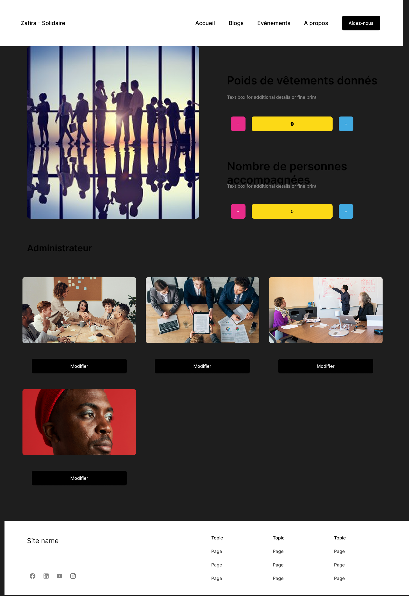
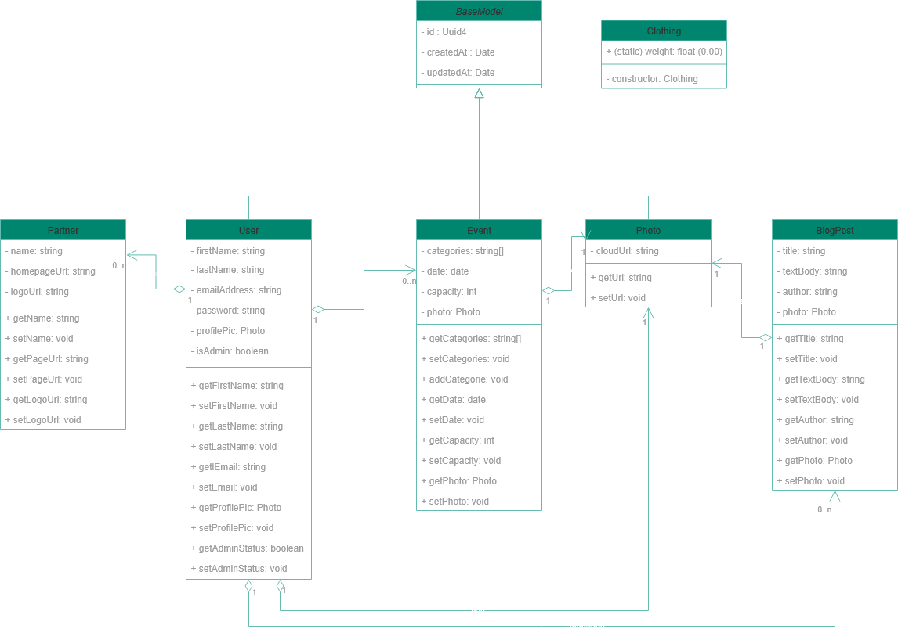
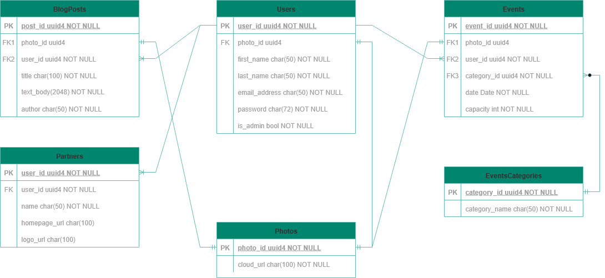

# ZAFIRA SOLIDAIRE - Portfolio - Stage 3: Technical Documentation

## In this stage of the project, the team will create a comprehensive blueprint for building the MVP. By planning technical aspects, source control, and quality assurance in advance, the team reduces risks, improves clarity, and enhances the development process

## 0 - Defining users stories

### Must-Have

    - As a Beneficiary, I want to be able to create an account so I can have access to the website's services.

    - As a Beneficiary, I want to be able consult events so I can take part in them given the availability.

    - As an Admin, I want to be able to manage events so that the association has a support to fulfill its missions.

    - As an Admin, I want to be able to manage events so that the association has a support to fulfill its missions.

    - As a Donator, I want to be able to take an apointment at a given location and a given date so I can donate clothes.

### Should-Have

    - As a Job Seeker, I want to upload a picture of my outfit so I can get remote feedback.

    - As a Volunteer, I want to leave notes after a session to track advice given.

### Could-have

    - As a Job Seeker, I want automated reminders via email/SMS so I don’t miss my appointment.

### Won't-have

    - As a job Seeker, I want to be able to bet my RSA on rooster fights.

---

## Mock-up

There is the intended look of the website, with first steps of involvment in graphical chart.

---

The front page is the first one seen when a user will connect to the website. It displays a summary of the site content, and some Zafira-Solidaire activities.

---

The blogs page will display recent interviews of local representatives, or articles concerning work market.

---

The event page will show the different workshops created by or involving Zafira-Solidaire and which a user can attend.

---

The admin dashboard aims to give a simple toolbox to an administrator willing to quickly change the website content, divided by pages.

---

The user page is a reminder of all the ways to contact the association, and a summary on the association philosophy.

---

## 1 - Design System Architecture

---

## 2 - Defining Components, Classes, and Database Design

### Class Diagram

---

### Entity Relationship Diagram

---

## 3 - Creating High-Level Sequence Diagrams

### User Account Creation Sequence Diagram

### User Login Sequence Diagram

### Admin Event Creation Sequence Diagram

## 4 - Planning SCM and QA Strategies

### Source Control Management Tools and Strategy

Our team will use **Git** as the version control system, with a **feature-based branching strategy**. This approach helps isolate development tasks and supports parallel teamwork.

### Branching Strategy

Each feature or task will be developed in its own branch. A "feature" typically represents the creation or update of a file, module, or functionality.

### Example Branch Names

- Creating a new model:
  `feature/create-user-model`
- Updating an existing model:
  `feature/update-user-model`

Once the feature is complete and tested, it will be **merged into the `development` branch** via a **Pull Request (PR)**, and the feature branch will be closed.

The branch flow will go as follow: feature/* → development → release → main

### SCM Best Practices

- Follow adopted **branch naming conventions**.
- Submit **Pull Requests** for all merges to `development` and `release`.
- **peer code reviews** before merging.

---

### Quality Assurance Tools and Strategy

### Backend Testing

We will use **Spring Boot’s testing mechanisms**, including:

- **Unit Testing** — using Mockito
- **Integration Testing** — testing interactions between services and components

### Frontend Testing

Frontend testing will be handled using:

- **React Testing Library**
- **Jest**

---

## SCM and QA workflow diagram

Below is a workflow diagram summarizing the above strategies.

