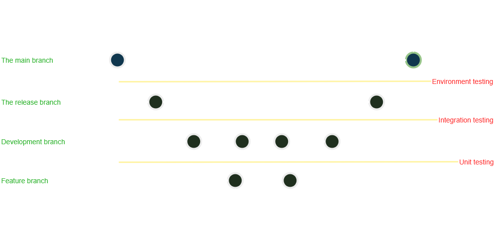

# Portfolio Project - MVP Development and Execution (Stage 4)

## 0. Plan and Define Sprints

# 🏃 Sprint Plan — [Sprint Name or Number]
**Sprint Duration:** 29/09/2025 → 24/10/2025
**Team:** DESSAIGNE Théo & CHEVALLIER Ancelin
**Sprint Goal:** This sprint aims at developing the MVP for Fariza Solidaire in preparation for the DemoDay.

---

## Overview
This sprint uses the **MoSCoW prioritization framework** to categorize tasks:

- **M (Must Have):** Critical to sprint success — must be delivered.
- **S (Should Have):** Important, but not critical for this sprint’s success.
- **C (Could Have):** Nice to include if time permits.
- **W (Won’t Have this time):** Agreed to leave out for now.

---

## ✅ Must Have (M)
| ID | Task | Description | Status |
|----|-------|-------------|--------|
| M1 | Beneficiary account| A beneficiary must be able to create a secure account | Done |
| M2 | Beneficiary event access | A beneficiary must be able to browse upcoming events thank to his account | Done |
| M3 | Admin dashboard | A dashboard for the admin to manage business entities like Users, BlogPosts, Events and Partners | Done |
| M4 | Donator contact | A Contact form has been put in place to allow for donators to get into contact with the admin | Done |

---

## 💪 Should Have (S)
| ID | Task | Description | Status |
|----|-------|-------------|-------|
| S1 | Image upload | The admin should be able to illustrate Blog Posts or events when needed | Done |

---

## 🌟 Could Have (C)
| ID | Task | Description |  Status |
|----|-------|-------------|--------|
| C1 | Email Validation | The user should be able to validate his email by receiving an email verification | To be Done |
| C2 | Beneficiary and Clothes metrics | Metrics about serviced beneficiaries and processed clothing should be diplsayed on the frontpage of the website  | Done |
| C2 | Photo gallery | The website should feature a photo gallery on the frontpage to showcase the association's identity | To be Done |

---

## 🚫 Won’t Have (W)
| ID | Task | Description | Reason for Deprioritization |
|----|-------|-------------|-----------------------------|
| W1 | Beneficiary Reviews | A beneficiary should be able to leave reviews to talk about his experience | Lack of time and unclear user business role |
| W2 | Reviews management | The admin should be able to validate revioews before they are displayed to the website | Beneficiary Reviews were deprioritized|

> ❌ Agreed to defer for future sprints.

---

## 📈 Sprint Organization
| Application section | Time required | Notes |
|--------|---------|---------|-------|
| Springboot Backend | 2.5 week | Took longer than initially expected |
| React Front End| 1.5 week | Aligned with previsions |
| Strapi integration | 0.5 week | Unexpected addition for simplicity sake |

---

## Retrospective Notes
- **What went well:**
  - The backend is fonctionnal and reliable.
  - Front end integration went well not major .
- **What could be improved:**
  - Time management because of the burden of learning a new language and environment.
  - Team communication.

---

## 1. Execute Development Tasks

### The following diagram represents the SCM flow and QA testing:
---

<picture>
    
</picture>

---

## Source Control Management Tools and Strategy

Our team will use **Git** as the version control system, with a **feature-based branching strategy**. This approach helps isolate development tasks and supports parallel teamwork.

### Branching Strategy

Each feature or task will be developed in its own branch. A "feature" typically represents the creation or update of a file, module, or functionality.

#### Example Branch Names:
- Creating a new model:
  `feature/create-user-model`
- Updating an existing model:
  `feature/update-user-model`

Once the feature is complete and tested, it will be **merged into the `development` branch** via a **Pull Request (PR)**, and the feature branch will be closed.

The branch flow will go as follow: feature/* → development → release → main

### SCM Best Practices:
- Follow adopted **branch naming conventions**.
- Submit **Pull Requests** for all merges to `development` and `release`.
- **peer code reviews** before merging.

---

## Quality Assurance Tools and Strategy

### Backend Testing

We will use **Spring Boot’s testing mechanisms**, including:
- **Unit Testing** — using Mockito
- **Integration Testing** — testing interactions between services and components

### Frontend Testing

Frontend testing will be conducted monitoring requests and resources using the browser's developer tools. More precisely the console for errors tracking, network tab for requests and responses monitoring and application storage to follow cookies state.

---

## 2. Progress monitoring and Adjustments:

## 🕘 Daily Stand-Ups

Daily stand-ups were conducted to maintain alignment and ensure continuous progress throughout the sprint.

During each session, team members briefly reviewed **completed tasks**, shared **current priorities**, and identified any **blockers** impacting delivery.

This is during one of those that **Users reviews** and **Admin Reviews Management** were deprioritized due to lack of clear scope about Users business role and time contraints.

---

## 3. Sprint Reviews and retrospectives:

### Sprint Retrospective Summary
### ✅ What Went Well
- Successful delivery of all **Must Have** and **Should Have** features.
- Clean integration between backend (Spring Boot) and frontend (React).
- Strapi integration simplified blog operations.

### ⚠️ What Could Be Improved
- Backend development timeline mismanaged. Future sprints should account for security and testing overhead.
- Need better estimation and prioritization for “Could Have” tasks.
- Clarify business roles with stakeholders for better implementation.

### 🚀 Actions for Next Sprint
- Implement **email validation** feature.
- Add **photo gallery** for improved visual engagement.
- Begin planning for **review system** with clearer requirements.

---

## 4. Final Integration and QA Testing

### ⚙️ Backend Integration Testing with Swagger

Thanks to springboot `CommandLIneRunner` class it was easy to initialize batch of instances like Users, Events and Partners to test controller methods on a slightly larger scale.

**Swagger UI** (auto-generated via SpringDoc OpenAPI) was used as the main interface for testing backend endpoints.
It allowed for real-time inspection, execution, and validation of REST APIs without relying on the frontend.

Every entity related controller were tested and passed the test following endpoint methods:

- Find by ID
- Find all
- Create
- Update
- delete by ID

Authentication endpoints were tested from the frontend-side to ensure proper working. For more about frontend-side integration testing, see below:

## 💻 Frontend Integration Testing with Chrome DevTools

### 🔍 Tool Used
**Chrome DevTools** was the main tool for testing frontend integration with backend APIs and verifying UI responsiveness, data flow, and error handling.

### 🧩 Test Areas
| Test Area | Description | Validation Method | Result |
|------------|-------------|------------------|--------|
| API Fetch Calls | Ensured React components correctly fetched data from backend APIs | Network tab → Observed request/response headers and payloads | Passed |
| Authentication Flow | Verified login, signup, and session persistence | Application tab → Local storage & cookies | Passed |
| Admin Dashboard | Checked CRUD operations for Users, BlogPosts, Events, and Partners | UI + Network tab monitoring | Passed |
| Metrics Display | Ensured real-time data was correctly fetched and displayed on the homepage | React component and data retireval | Passed |
| Error Handling | Tested invalid form entries and 4xx/5xx responses | Console + Network tab | Passed with handled errors |

---

## 5. Final Thoughts

Overall, this was a very interesting project to carry out, offering the opportunity to explore new technologies and development environments.
Although learning an entirely new programming language (Java) and framework (Spring Boot) made the time constraints feel quite tight, many valuable concepts were learned and successfully applied.
This experience will undoubtedly carry over into future projects and contribute to a stronger professional mindset.
Mistakes were made, lessons were learned, and better students, and aspiring developers, emerged from it.

For a more in-depths analysis here is the link to the project's repository:

https://github.com/Theo-D/holbertonschool-fariza_solidaire/tree/development

---

### Authors:
**DESSAIGNE Théo** & **CHEVALLIER Ancelin**
